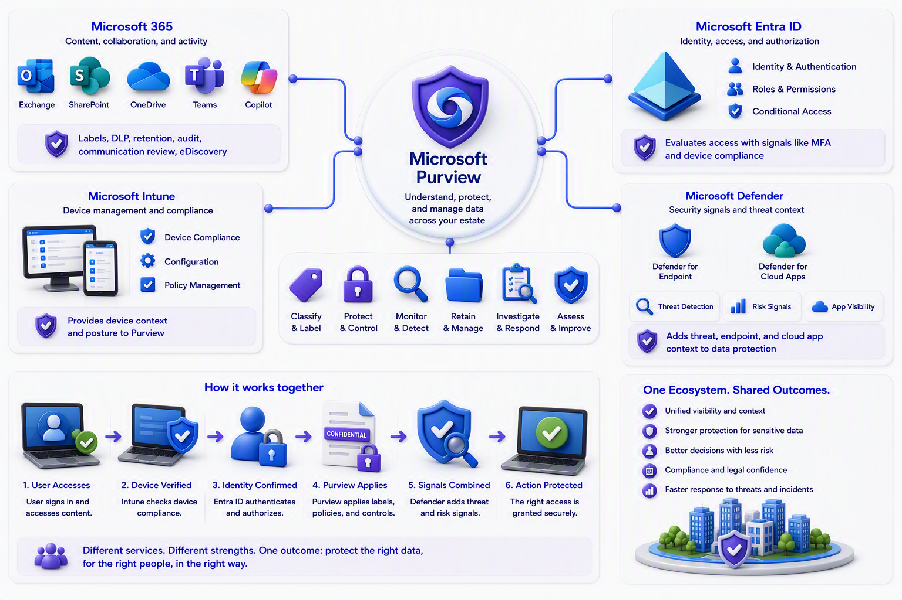

# Chapter 10: The Supporting Microsoft Ecosystem

Purview works because it connects to the platforms where identity, devices, data, collaboration, and applications already live.

Microsoft 365 provides key content locations and activity signals. Exchange, SharePoint, OneDrive, Teams, and Copilot are where labels, DLP, retention, audit, communication review, and eDiscovery frequently meet.

Microsoft Entra ID provides identity, authorization, roles, and Conditional Access. For Rights Management-protected documents, Conditional Access can evaluate conditions such as multifactor authentication or whether a device complies with Intune policy.

Microsoft Intune contributes device compliance and configuration context. Microsoft Defender for Endpoint and Defender for Cloud Apps contribute endpoint, application, cloud-app, and threat context. These services do not become Purview; they complement it. Purview focuses on the data and compliance question, while Defender focuses more heavily on threats and security operations, Entra on identity and access, and Intune on device management.

[Manage generative AI apps for your organization](https://learn.microsoft.com/en-us/microsoft-365/copilot/manage-generative-ai-apps)

[Investigate Insider Risk Management alerts in Microsoft Defender XDR](https://learn.microsoft.com/en-us/defender-xdr/irm-investigate-alerts-defender)

For architects, that distinction matters. A complete design is rarely “deploy Purview.” It is more often “connect identity, devices, content locations, data platforms, security telemetry, legal processes, and governance ownership around shared business outcomes.”

The integrations matter because information risk rarely stays inside one service. Identity determines who may enter, device posture influences how safely they connect, security tools identify suspicious behavior, and Purview adds understanding of the data involved. A strong architecture joins these signals around a small number of well-defined outcomes instead of deploying each capability as a separate project.

For example, a user opens a protected file from a managed laptop. Entra confirms identity. Intune provides device context. Purview applies the information rules. Defender can add threat signals. Each service answers a different question, but the final decision protects one business action.

\
\
[Purview Introduction Start Page](/Readme.md)

[Purview Introduction Chapter 1](/PurviewIntroductionChapter1.md)

[Purview Introduction Chapter 2](/PurviewIntroductionChapter2.md)

[Purview Introduction Chapter 3](/PurviewIntroductionChapter3.md)

[Purview Introduction Chapter 4](/PurviewIntroductionChapter4.md)

[Purview Introduction Chapter 5](/PurviewIntroductionChapter5.md)

[Purview Introduction Chapter 6](/PurviewIntroductionChapterä6.md)

[Purview Introduction Chapter 7](/PurviewIntroductionChapter7.md)

[Purview Introduction Chapter 8](/PurviewIntroductionChapter8.md)

[Purview Introduction Chapter 9](/PurviewIntroductionChapter9.md)

[Purview Introduction Chapter 10](/PurviewIntroductionChapter10.md)

[Purview Introduction Chapter 11](/PurviewIntroductionChapter11.md)

[Purview Introduction Chapter 12](/PurviewIntroductionChapter12.md)

