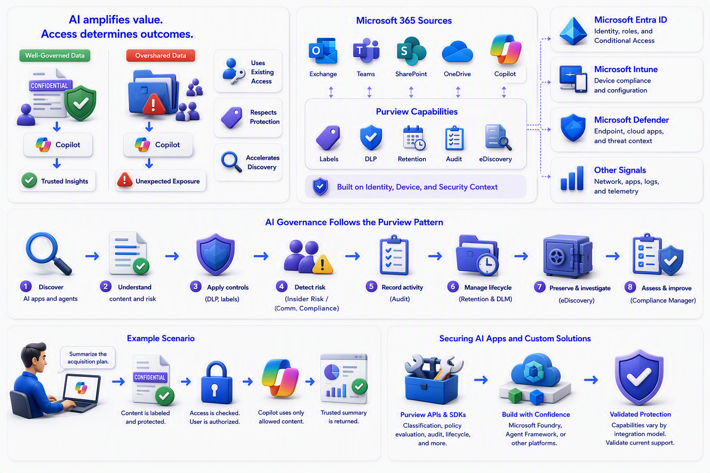

# Chapter 11: Purview in the Age of AI

AI increases the value of trusted data, but it can also amplify existing access and oversharing problems.

Microsoft 365 Copilot respects the permissions and data-protection controls already present in Microsoft 365. It does not grant a user new access merely because the user asks a question. However, if people already have access to content that was shared too broadly, AI can make that content easier to discover and combine. That is why access hygiene, labels, DLP, retention, and audit form the foundation of AI readiness.

[Microsoft 365 Copilot architecture and how it works](https://learn.microsoft.com/en-us/microsoft-365/copilot/microsoft-365-copilot-architecture-data-protection-auditing)

[Configure a secure and governed data foundation for Microsoft 365 Copilot](https://learn.microsoft.com/en-us/microsoft-365/copilot/configure-secure-governed-data-foundation-microsoft-365-copilot)

The current DSPM experience extends monitoring and posture management across AI apps and agents. The older DSPM for AI (classic) experience grouped activity into Microsoft Copilot experiences and agents, Enterprise AI apps, and Other AI apps. Microsoft documentation now positions the broader DSPM experience as the forward-looking model while retaining classic documentation for existing deployments.

[Learn about Data Security Posture Management](https://learn.microsoft.com/en-us/purview/data-security-posture-management-learn-about)

[Learn how to use Data Security Posture Management for AI](https://learn.microsoft.com/en-us/purview/dspm-for-ai)

The AI governance story follows the same pattern as the rest of Purview:

AI readiness is therefore less about creating an entirely new governance program and more about strengthening the fundamentals. Organizations should know which information is valuable, remove unnecessary broad access, clarify acceptable AI use, and ensure that people can report unexpected results. With that foundation, AI can improve discovery and productivity without weakening accountability.

For example, a user asks Copilot to summarize a project. Copilot can use information the user is allowed to access. If an old site was shared too broadly, the summary may reveal information the user did not expect to find. The lesson is simple: improve access hygiene before relying on AI at scale.

First, discover which AI apps and agents are being used. Then understand whether prompts, responses, or grounding data contain sensitive information. Apply DLP or labels where supported. Detect risky behavior through Insider Risk Management and Communication Compliance. Record activity through Audit. Manage prompts and responses with lifecycle policies. Preserve and investigate them through eDiscovery when required. Assess regulatory controls through Compliance Manager.

[Security and governance in the Microsoft 365 Copilot Control System](https://learn.microsoft.com/en-us/microsoft-365/copilot/copilot-control-system/security-governance)

[Step 4: Govern and protect data in AI apps](https://learn.microsoft.com/en-us/purview/deploymentmodels/depmod-data-leak-shadow-ai-step4)

For custom applications, Microsoft Purview APIs and SDK capabilities can bring classification, policy evaluation, audit, communication-compliance, lifecycle, and investigation signals into AI applications built with Microsoft Foundry, Agent Framework, or other platforms. The exact level of support varies by application and integration model, so architects should validate the current capability matrix rather than assume identical protection everywhere.

[Develop an AI app secured with Microsoft Purview](https://learn.microsoft.com/en-us/purview/developer/secure-ai-with-purview)

[Use Microsoft Purview to manage AI agents](https://learn.microsoft.com/en-us/purview/ai-agents)

\
\
[Purview Introduction Start Page](/Readme.md)

[Purview Introduction Chapter 1](/PurviewIntroductionChapter1.md)

[Purview Introduction Chapter 2](/PurviewIntroductionChapter2.md)

[Purview Introduction Chapter 3](/PurviewIntroductionChapter3.md)

[Purview Introduction Chapter 4](/PurviewIntroductionChapter4.md)

[Purview Introduction Chapter 5](/PurviewIntroductionChapter5.md)

[Purview Introduction Chapter 6](/PurviewIntroductionChapterä6.md)

[Purview Introduction Chapter 7](/PurviewIntroductionChapter7.md)

[Purview Introduction Chapter 8](/PurviewIntroductionChapter8.md)

[Purview Introduction Chapter 9](/PurviewIntroductionChapter9.md)

[Purview Introduction Chapter 10](/PurviewIntroductionChapter10.md)

[Purview Introduction Chapter 11](/PurviewIntroductionChapter11.md)

[Purview Introduction Chapter 12](/PurviewIntroductionChapter12.md)

