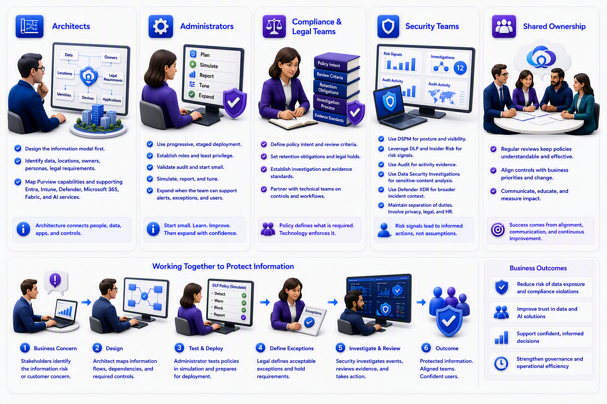

# Chapter 12: What This Means for Each Role

**Architects**

Design the information model before the control model. Identify important data, locations, owners, personas, legal requirements, identities, devices, and application paths. Then map the required Purview capabilities and supporting Entra, Intune, Defender, Microsoft 365, Fabric, and AI services.

**Administrators**

Favor progressive deployment. Establish roles and least privilege. Validate audit. Start labels and DLP with a controlled scope. Use simulation and reporting. Tune false positives. Expand only when the operating team can support alerts, exceptions, and user questions. Microsoft’s deployment models follow this staged, outcome-based approach.

**Compliance and Legal Teams**

Define the policy intent, review criteria, retention obligations, investigation process, and evidence standards. Technical teams can translate those decisions into labels, retention, records, communication review, audit retention, and eDiscovery workflows.

**Security Teams**

Use DSPM for posture, DLP and Insider Risk Management for risk signals, Audit for activity evidence, Data Security Investigations for sensitive-content analysis, and Defender XDR for broader incident context. Maintain separation of duties and involve privacy, legal, and employee-relations stakeholders when user-level investigations are involved.

[Learn about Data Security Posture Management](https://learn.microsoft.com/en-us/purview/data-security-posture-management-learn-about)

[Learn about Data Security Investigations](https://learn.microsoft.com/en-us/purview/data-security-investigations)

Across all roles, success depends on shared ownership. Sellers frame the outcome, architects connect the design, administrators operate the controls, legal and compliance teams define obligations, and security teams investigate risk. Regular reviews between these groups help ensure that policies remain understandable, proportionate, and aligned with changing business priorities.

For example, a seller may identify accidental data sharing as the customer concern. An architect maps the information flows. An administrator tests a DLP policy. Legal defines acceptable exceptions. Security prepares the review process. The outcome succeeds because the roles work as one team.

**Common Questions and Misconceptions**

“Is Purview one product?”

Not quite. It is a portfolio of connected governance, security, and compliance solutions presented through a common portal. Licensing and permissions determine which capabilities are available. [Microsoft Purview documentation](https://learn.microsoft.com/en-us/purview/), [Learn about the Microsoft Purview portal](https://learn.microsoft.com/en-us/purview/purview-portal)

“Are classification, labels, and DLP the same?”

No. Classification recognizes or describes information. A label expresses sensitivity and may enforce protection. DLP evaluates activities and can audit, warn, or restrict them.

“Does a sensitivity label prevent every leak?”

No single control does. Labels can persistently protect supported content. DLP covers important use and movement scenarios. Identity, device compliance, endpoint security, access governance, and user education remain necessary.

“Does Purview Data Map copy all our data?”

Data Map primarily stores metadata about assets, not the underlying business data. Scanning may sample data for classification depending on configuration, but catalog permissions do not automatically grant access to the source data. [Plan for data governance](https://learn.microsoft.com/en-us/purview/data-governance-plan), [Scans and ingestion in Microsoft Purview Data Map](https://learn.microsoft.com/en-us/purview/data-map-scan-ingestion)

“Does Copilot bypass permissions?”

Microsoft documents that Copilot grounds responses in content the user is authorized to access and honors supported sensitivity-label and encryption controls. The larger concern is often pre-existing oversharing, not Copilot creating new permissions.

[Data, privacy, and security for Microsoft 365 Copilot](https://learn.microsoft.com/en-us/microsoft-365/copilot/microsoft-365-copilot-privacy)

[Microsoft 365 Copilot architecture and how it works](https://learn.microsoft.com/en-us/microsoft-365/copilot/microsoft-365-copilot-architecture-data-protection-auditing)

“Does an insider-risk alert prove wrongdoing?”

No. It identifies activity that meets configured risk conditions. A properly authorized team must investigate context and follow the organization’s legal, privacy, and employment processes.

“Does a high Compliance Manager score mean we are compliant?”

It indicates progress against mapped improvement actions and controls. It does not replace legal advice, regulatory interpretation, independent audit, or evidence review.

[Microsoft Purview Compliance Manager](https://learn.microsoft.com/en-us/purview/compliance-manager)

[Working with improvement actions in Compliance Manager](https://learn.microsoft.com/en-us/purview/compliance-manager-improvement-actions)

**Mini-Glossary**

| **Term** | **Beginner meaning** |
| --- | --- |
| Sensitive information type | A detector for recognizable sensitive data. |
| Trainable classifier | A classifier trained from examples of business content. |
| Sensitivity label | A business classification that can carry protection settings. |
| DLP | Policies that evaluate and control risky data activities. |
| Endpoint DLP | DLP controls for activities performed on managed devices. |
| Insider Risk Management | Signals and workflows for investigating potentially risky internal activity. |
| Adaptive Protection | Risk-based controls that adjust as user risk context changes. |
| DSPM | A posture layer showing sensitive-data exposure, policy gaps, and remediation objectives. |
| Audit | Searchable records of supported user and administrative activity. |
| eDiscovery | A case-based process for preserving, collecting, reviewing, and exporting evidence. |
| Retention | Rules governing how long content is kept or when it is deleted. |
| Record | Authoritative content managed under stronger lifecycle requirements. |
| Data Map | The technical metadata inventory and lineage foundation. |
| Unified Catalog | The business-friendly discovery and governance experience built on Data Map. |
| Data product | A governed grouping of assets prepared for a defined business use. |
| AI interaction | A prompt, response, referenced content, or related activity involving an AI application or agent. |

**Curated Microsoft Learn Journey**

**Beginner**

Begin with the portfolio and the two introductory security and compliance modules.

- [Microsoft Purview documentation](https://learn.microsoft.com/en-us/purview/)

- [Microsoft Learn for Microsoft Purview](https://learn.microsoft.com/en-us/training/purview/)

- [Describe the data security solutions of Microsoft Purview](https://learn.microsoft.com/en-us/training/modules/describe-purview-data-solutions/)

- [Describe the data compliance solutions of Microsoft Purview](https://learn.microsoft.com/en-us/training/modules/describe-purview-risk-compliance-governance/)

- [Introduction to Microsoft Security, Compliance, and Identity](https://learn.microsoft.com/en-us/training/courses/sc-900t00)

- [Microsoft Certified: Security, Compliance, and Identity Fundamentals](https://learn.microsoft.com/en-us/credentials/certifications/security-compliance-and-identity-fundamentals/)

**Intermediate**

Move into the operational learning paths after you understand classification, labels, DLP, retention, and investigations.

·       [Implement Microsoft Purview Information Protection](https://learn.microsoft.com/en-us/training/paths/purview-implement-information-protection/)

·       [Implement and manage Microsoft Purview Data Loss Prevention](https://learn.microsoft.com/en-us/training/paths/purview-implement-manage-dlp/)

·       [Implement and manage Insider Risk Management](https://learn.microsoft.com/en-us/training/paths/purview-implement-insider-risk-management/)

·       [Reduce data exposure risk with Microsoft Purview Data Security Posture Management](https://learn.microsoft.com/en-us/training/paths/purview-data-security-posture-management/)

·       [Manage investigations with eDiscovery](https://learn.microsoft.com/en-us/training/paths/purview-ediscovery-manage-investigations/)

·       [Implement retention, eDiscovery, and Communication Compliance](https://learn.microsoft.com/en-us/training/paths/purview-implement-retention-ediscovery-communication-compliance/)

·       [Understand Microsoft Purview Unified Catalog](https://learn.microsoft.com/en-us/training/modules/purview-unified-catalog-understand/)

·       [Secure and govern Microsoft 365 Copilot interactions](https://learn.microsoft.com/en-us/training/paths/purview-secure-govern-copilot-interactions/)

**Advanced and role-based**

For administrators and architects, the primary role-based route is SC-401. The current certification covers information protection, DLP, retention, insider risk, alerts, activities, and protection of data used by AI services.

·       [Protect sensitive information with Microsoft Purview in the AI era - Training](https://learn.microsoft.com/en-us/training/courses/sc-401t00)

·       [Microsoft Certified: Information Security Administrator Associate](https://learn.microsoft.com/en-us/credentials/certifications/information-security-administrator/)

·       [Study guide for Exam SC-401: Administering Information Security in Microsoft 365](https://learn.microsoft.com/en-us/credentials/certifications/resources/study-guides/sc-401)

·       [Secure AI interactions and environments with Microsoft Purview](https://learn.microsoft.com/en-us/training/paths/purview-protect-ai/)

·       [Microsoft Purview deployment models](https://learn.microsoft.com/en-us/purview/deploymentmodels/)

**Applied Skills**

Applied Skills are useful when the goal is to validate a focused, hands-on scenario rather than an entire job role.

·       [Implement information protection and data loss prevention by using Microsoft Purview](https://learn.microsoft.com/en-us/credentials/applied-skills/implement-information-protection-and-data-loss-prevention-by-using-microsoft-purview/)

·       [Implement retention, eDiscovery, and Communication Compliance in Microsoft Purview](https://learn.microsoft.com/en-us/credentials/applied-skills/implement-retention-ediscovery-and-communication-compliance-in-microsoft-purview/)

·       [Protect information in Microsoft 365 Copilot by using Microsoft Purview](https://learn.microsoft.com/en-us/credentials/applied-skills/protect-information-in-microsoft-365-copilot-by-using-microsoft-purview/)

·       [Implement information protection and data loss prevention by using Microsoft Purview](https://learn.microsoft.com/en-us/credentials/applied-skills/implement-information-protection-and-data-loss-prevention-by-using-microsoft-purview/)

·       [Implement retention, eDiscovery, and Communication Compliance in Microsoft Purview](https://learn.microsoft.com/en-us/credentials/applied-skills/implement-retention-ediscovery-and-communication-compliance-in-microsoft-purview/)

·       [Protect information in Microsoft 365 Copilot by using Microsoft Purview](https://learn.microsoft.com/en-us/credentials/applied-skills/protect-information-in-microsoft-365-copilot-by-using-microsoft-purview/)

The simplest learning sequence is therefore: understand the business problem, learn classification and labels, add DLP, understand risk and investigation, learn lifecycle and compliance, then expand into data governance and AI. Once that mental model is established, the architecture stops looking like a collection of unrelated boxes. It becomes a connected system for turning data into something the organization can find, trust, protect, govern, and use responsibly.

\
\
[Purview Introduction Start Page](/Readme.md)

[Purview Introduction Chapter 1](/PurviewIntroductionChapter1.md)

[Purview Introduction Chapter 2](/PurviewIntroductionChapter2.md)

[Purview Introduction Chapter 3](/PurviewIntroductionChapter3.md)

[Purview Introduction Chapter 4](/PurviewIntroductionChapter4.md)

[Purview Introduction Chapter 5](/PurviewIntroductionChapter5.md)

[Purview Introduction Chapter 6](/PurviewIntroductionChapterä6.md)

[Purview Introduction Chapter 7](/PurviewIntroductionChapter7.md)

[Purview Introduction Chapter 8](/PurviewIntroductionChapter8.md)

[Purview Introduction Chapter 9](/PurviewIntroductionChapter9.md)

[Purview Introduction Chapter 10](/PurviewIntroductionChapter10.md)

[Purview Introduction Chapter 11](/PurviewIntroductionChapter11.md)

[Purview Introduction Chapter 12](/PurviewIntroductionChapter12.md)

