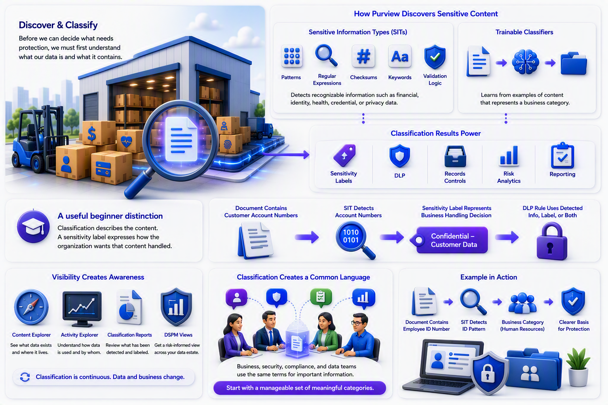

## Chapter 2: Discovery Begins with Classification

Our first stop is Discover & Classify.

Imagine a warehouse containing millions of unmarked boxes. Before deciding which boxes require locks, you need to know what is inside them. Purview classification plays that role.

Purview can identify sensitive content through sensitive information types, often called SITs. These detect recognizable information such as financial, identity, health, credential, or privacy-related data. Detection can use patterns, regular expressions, checksums, keywords, and validation logic. Trainable classifiers take a different approach: they learn from examples of content that represents a business category. Classification results can then be used by labels, DLP, records controls, risk analytics, and reporting.

[All credentials sensitive information types](https://learn.microsoft.com/purview/sit-defn-all-creds)

[Microsoft Purview data security solutions](https://learn.microsoft.com/en-us/purview/purview-security)

A useful beginner distinction is this:

Classification describes the content. A sensitivity label expresses how the organization wants that content handled.

Suppose a document contains customer account numbers. A sensitive information type may recognize those numbers. A sensitivity label such as Confidential – Customer Data can then represent the business handling decision. A DLP rule may use either the detected information, the label, or both when deciding whether to allow an action.

Discovery also includes visibility. Content Explorer, Activity Explorer, classification reports, and related DSPM views help authorized teams understand what has been detected and what users or applications are doing with that content. This is important because classification is not a one-time project. Data changes, applications change, and business language changes.

For beginners, the key lesson is that classification creates a common language. When business, security, compliance, and data teams use the same terms for important information, policies become easier to explain and apply. Good classification therefore begins with a manageable set of meaningful categories rather than an attempt to label everything at once.

For example, a document may contain an employee identification number. A sensitive information type can detect the pattern. A business category can explain that the document belongs to human resources. Together, these signals give the organization a clearer basis for protection.

\
\
[Purview Introduction Start Page](/Readme.md)

[Purview Introduction Chapter 1](/PurviewIntroductionChapter1.md)

[Purview Introduction Chapter 2](/PurviewIntroductionChapter2.md)

[Purview Introduction Chapter 3](/PurviewIntroductionChapter3.md)

[Purview Introduction Chapter 4](/PurviewIntroductionChapter4.md)

[Purview Introduction Chapter 5](/PurviewIntroductionChapter5.md)

[Purview Introduction Chapter 6](/PurviewIntroductionChapterä6.md)

[Purview Introduction Chapter 7](/PurviewIntroductionChapter7.md)

[Purview Introduction Chapter 8](/PurviewIntroductionChapter8.md)

[Purview Introduction Chapter 9](/PurviewIntroductionChapter9.md)

[Purview Introduction Chapter 10](/PurviewIntroductionChapter10.md)

[Purview Introduction Chapter 11](/PurviewIntroductionChapter11.md)

[Purview Introduction Chapter 12](/PurviewIntroductionChapter12.md)

