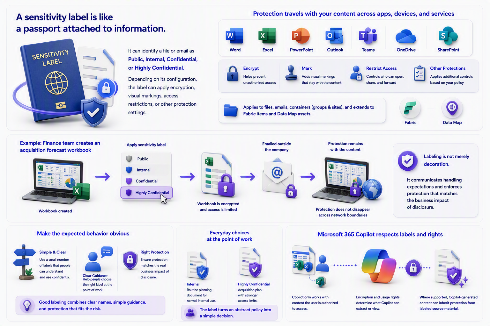

# Chapter 3: Sensitivity Labels Give Data a Passport

A sensitivity label is like a passport attached to information.

It can identify a file or email as Public, Internal, Confidential, or Highly Confidential. Depending on its configuration, the label can apply encryption, visual markings, access restrictions, or other protection settings. The protection can remain with the content as it moves across supported apps, devices, and services. Sensitivity labels can also apply to containers such as groups and sites, and their scope can extend beyond traditional Office files to supported Fabric items and Data Map assets.

[Learn about sensitivity labels](https://learn.microsoft.com/en-us/purview/sensitivity-labels)

[Learn about Azure Rights Management](https://learn.microsoft.com/en-us/purview/azure-rights-management-learn-about)

For example, a finance team creates a workbook containing acquisition forecasts. Applying a highly confidential label could encrypt the workbook and limit who may open it. If the file is emailed outside the company, the protection does not simply disappear because the file crossed a network boundary.

This is why labeling is not merely decoration. The visible name helps people understand the handling expectation. The underlying configuration can enforce protection.

The label should make the expected behavior obvious to the person handling the information. A small, understandable label scheme is usually more useful than a long list of choices that people cannot distinguish. The strongest programs combine clear names, simple guidance, and protection that matches the real business impact of disclosure.

For example, an employee may choose Internal for a routine planning document and Highly Confidential for an acquisition plan. The first choice communicates normal internal use. The second can add stronger access limits. The label turns an abstract policy into a simple decision at the point of work.

Microsoft 365 Copilot also recognizes sensitivity labels and associated usage rights. Copilot only works with content the user is authorized to access, and encryption rights can determine whether Copilot may extract or view the content. Where supported, generated content can inherit protection from labeled source material.

[Microsoft 365 Copilot architecture and how it works](https://learn.microsoft.com/en-us/microsoft-365/copilot/microsoft-365-copilot-architecture-data-protection-auditing)

[Data, privacy, and security for Microsoft 365 Copilot](https://learn.microsoft.com/en-us/microsoft-365/copilot/microsoft-365-copilot-privacy)

\
\
[Purview Introduction Start Page](/Readme.md)

[Purview Introduction Chapter 1](/PurviewIntroductionChapter1.md)

[Purview Introduction Chapter 2](/PurviewIntroductionChapter2.md)

[Purview Introduction Chapter 3](/PurviewIntroductionChapter3.md)

[Purview Introduction Chapter 4](/PurviewIntroductionChapter4.md)

[Purview Introduction Chapter 5](/PurviewIntroductionChapter5.md)

[Purview Introduction Chapter 6](/PurviewIntroductionChapterä6.md)

[Purview Introduction Chapter 7](/PurviewIntroductionChapter7.md)

[Purview Introduction Chapter 8](/PurviewIntroductionChapter8.md)

[Purview Introduction Chapter 9](/PurviewIntroductionChapter9.md)

[Purview Introduction Chapter 10](/PurviewIntroductionChapter10.md)

[Purview Introduction Chapter 11](/PurviewIntroductionChapter11.md)

[Purview Introduction Chapter 12](/PurviewIntroductionChapter12.md)

