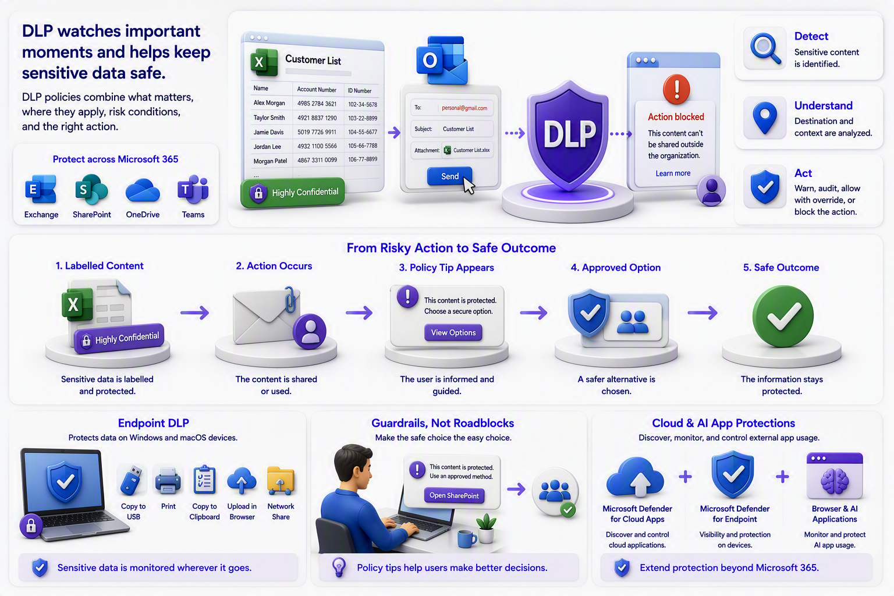

# Chapter 4: DLP Protects the Moments of Movement

Labels describe and protect data. Data Loss Prevention, or DLP, watches important moments when people or applications use it.

A DLP policy combines several decisions: what sensitive information matters, where the policy applies, which conditions indicate risk, and what action should occur. Actions can range from recording the event to warning the user, allowing an override, or blocking the activity. Microsoft 365 locations can include services such as Exchange, SharePoint, OneDrive, and Teams.

[Microsoft Purview data security solutions](https://learn.microsoft.com/en-us/purview/purview-security)

[Implement and manage Microsoft Purview Data Loss Prevention](https://learn.microsoft.com/en-us/training/paths/purview-implement-manage-dlp/)

Consider an employee emailing a spreadsheet containing customer identity numbers to a personal address. DLP may detect the content, recognize the destination, display a policy tip, and block or audit the action according to company policy. The purpose is not to distrust every employee. It is to make the safe behavior easier and to reduce accidental exposure.

Endpoint DLP takes the story onto Windows and macOS devices. Once a file reaches a device, Endpoint DLP can evaluate activities such as copying to USB, printing, copying to the clipboard, uploading through a browser, or transferring to a network share. Microsoft’s learning guidance emphasizes simulation, gradual enforcement, and investigation so policies protect information without unnecessarily disrupting normal work.

DLP works best as a guardrail rather than a collection of surprise restrictions. Users should understand why a warning appears, what safer alternative is available, and where to ask for help. This turns a policy event into a learning moment while giving the organization evidence about where processes or guidance may need improvement.

For example, a user may try to send a customer list to a personal email address. A policy tip can explain the concern and suggest an approved sharing method. The user can correct the action immediately. The organization can still record the event for review.

For cloud and AI-app scenarios, Microsoft Defender for Cloud Apps can help discover, monitor, sanction, or block cloud applications, while Microsoft Defender for Endpoint contributes device and application visibility for onboarded endpoints. This becomes important when people use browser-based AI services outside the organization’s formally approved toolset.

[Manage generative AI apps for your organization](https://learn.microsoft.com/en-us/microsoft-365/copilot/manage-generative-ai-apps)

[Zero Trust for Microsoft 365](https://learn.microsoft.com/en-us/security/zero-trust/microsoft-365-zero-trust)

\
\
[Purview Introduction Start Page](/Readme.md)

[Purview Introduction Chapter 1](/PurviewIntroductionChapter1.md)

[Purview Introduction Chapter 2](/PurviewIntroductionChapter2.md)

[Purview Introduction Chapter 3](/PurviewIntroductionChapter3.md)

[Purview Introduction Chapter 4](/PurviewIntroductionChapter4.md)

[Purview Introduction Chapter 5](/PurviewIntroductionChapter5.md)

[Purview Introduction Chapter 6](/PurviewIntroductionChapterä6.md)

[Purview Introduction Chapter 7](/PurviewIntroductionChapter7.md)

[Purview Introduction Chapter 8](/PurviewIntroductionChapter8.md)

[Purview Introduction Chapter 9](/PurviewIntroductionChapter9.md)

[Purview Introduction Chapter 10](/PurviewIntroductionChapter10.md)

[Purview Introduction Chapter 11](/PurviewIntroductionChapter11.md)

[Purview Introduction Chapter 12](/PurviewIntroductionChapter12.md)

