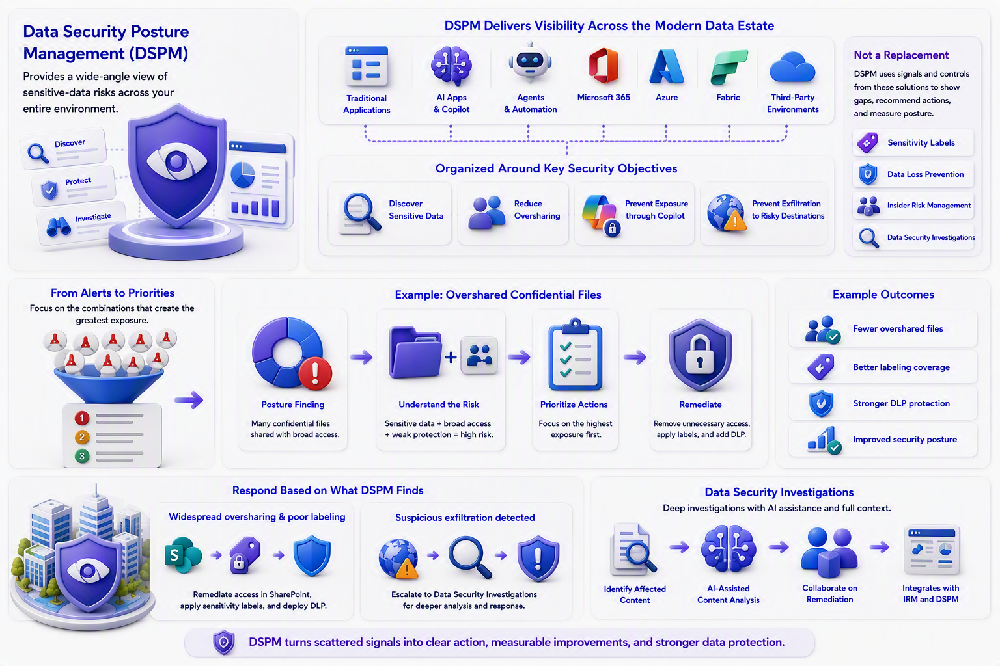

# Chapter 6: DSPM Provides the Wide-Angle View

Individual policies are useful, but large organizations can struggle to understand whether all the policies add up to an effective posture. Data Security Posture Management, or DSPM, provides the wide-angle view.

The current DSPM experience focuses on discovering, protecting, and investigating sensitive-data risks across traditional applications, AI apps, agents, Microsoft 365, Azure, Fabric, and supported third-party environments. It organizes work around security objectives such as discovering sensitive data, reducing oversharing, preventing exposure through Copilot, and preventing exfiltration to risky destinations.

[Learn about Data Security Posture Management](https://learn.microsoft.com/en-us/purview/data-security-posture-management-learn-about)

[Understand Microsoft Purview Data Security Posture Management](https://learn.microsoft.com/en-us/training/modules/purview-data-security-posture-management-understand/)

DSPM is not a replacement for labels, DLP, or Insider Risk Management. It uses signals and controls from those solutions to show gaps, recommend actions, and measure changes in posture.

A posture view is valuable because it helps teams move from isolated alerts to priorities. Instead of treating every finding as equally urgent, they can focus on the combinations that create the greatest exposure, such as sensitive information, broad access, and weak protection appearing together. This makes remediation more understandable to business owners and easier to sequence.

For example, a posture view may show that many confidential files are shared through broad links. The first response is not another dashboard. It is a focused plan. Owners can remove unnecessary access, apply labels, and add DLP where the exposure is greatest.

If the posture view says that sensitive files are widely shared and poorly labeled, the response may involve SharePoint access remediation, sensitivity labeling, and DLP. If it finds suspicious exfiltration, a security team may escalate into Data Security Investigations.

Data Security Investigations helps cybersecurity teams identify affected content, analyze sensitive-data exposure, collaborate on remediation, and use AI-assisted content analysis. It also integrates with Insider Risk Management and DSPM so a high-level risk can become a focused investigation.

[Learn about Data Security Investigations](https://learn.microsoft.com/en-us/purview/data-security-investigations)

[Investigate data security risks with Microsoft Purview](https://learn.microsoft.com/en-us/training/modules/purview-data-security-posture-management-investigate-risks/)

\
\
[Purview Introduction Start Page](/Readme.md)

[Purview Introduction Chapter 1](/PurviewIntroductionChapter1.md)

[Purview Introduction Chapter 2](/PurviewIntroductionChapter2.md)

[Purview Introduction Chapter 3](/PurviewIntroductionChapter3.md)

[Purview Introduction Chapter 4](/PurviewIntroductionChapter4.md)

[Purview Introduction Chapter 5](/PurviewIntroductionChapter5.md)

[Purview Introduction Chapter 6](/PurviewIntroductionChapterä6.md)

[Purview Introduction Chapter 7](/PurviewIntroductionChapter7.md)

[Purview Introduction Chapter 8](/PurviewIntroductionChapter8.md)

[Purview Introduction Chapter 9](/PurviewIntroductionChapter9.md)

[Purview Introduction Chapter 10](/PurviewIntroductionChapter10.md)

[Purview Introduction Chapter 11](/PurviewIntroductionChapter11.md)

[Purview Introduction Chapter 12](/PurviewIntroductionChapter12.md)

