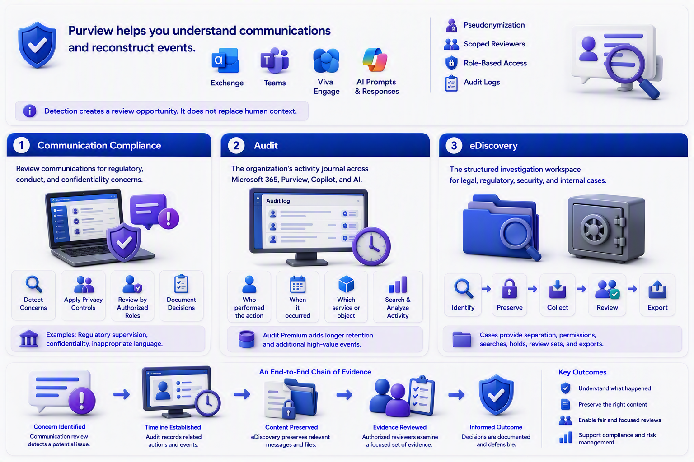

# Chapter 7: Communication, Evidence, and Investigation

Purview also helps organizations understand communications and reconstruct events.

Communication Compliance examines supported communications for potential regulatory, conduct, or confidentiality concerns. That can include Exchange, Teams, Viva Engage, and supported AI prompts and responses. It uses privacy-oriented controls such as pseudonymization, scoped reviewers, role-based access, and audit logs.

A financial-services organization might use it to identify communications that could breach supervisory rules. Another organization might focus on accidental sharing of confidential information or inappropriate language. Detection creates a review opportunity. It does not replace human context.

Audit is the organization’s activity journal. It records supported user and administrative activity across Microsoft 365, Purview, Copilot, and connected AI scenarios. Authorized investigators can search audit records to understand who performed an action, when it occurred, and which service or object was involved. Audit Premium adds capabilities such as longer retention and additional high-value events, subject to licensing.

[Audit log activities](https://learn.microsoft.com/en-us/purview/audit-log-activities)

[Conduct investigations with Microsoft Purview Audit](https://learn.microsoft.com/en-us/training/modules/purview-audit-search-investigate/)

eDiscovery is the structured investigation workspace. It supports identifying, preserving, collecting, reviewing, analyzing, and exporting content relevant to legal, regulatory, security, or internal investigations. Cases provide separation, permissions, searches, holds, review sets, and export workflows.

[Get started with Microsoft Purview eDiscovery](https://learn.microsoft.com/en-us/purview/edisc-get-started)

[Manage investigations with eDiscovery](https://learn.microsoft.com/en-us/training/paths/purview-ediscovery-manage-investigations/)

A useful analogy is: Audit is the building’s access log. eDiscovery is the secure investigation room where relevant evidence is preserved, organized, reviewed, and produced.

Together, these capabilities support a chain of evidence. Communication review may identify a concern, Audit can help establish a timeline, and eDiscovery can preserve and organize relevant content. Clear roles and documented handoffs are essential so an investigation remains focused, fair, and defensible.

For example, an investigation may begin with a message that appears to contain restricted information. Audit can show related actions. eDiscovery can preserve relevant messages and files. Reviewers can then examine a defined set of evidence instead of searching the entire environment without a clear scope.

\
\
[Purview Introduction Start Page](/Readme.md)

[Purview Introduction Chapter 1](/PurviewIntroductionChapter1.md)

[Purview Introduction Chapter 2](/PurviewIntroductionChapter2.md)

[Purview Introduction Chapter 3](/PurviewIntroductionChapter3.md)

[Purview Introduction Chapter 4](/PurviewIntroductionChapter4.md)

[Purview Introduction Chapter 5](/PurviewIntroductionChapter5.md)

[Purview Introduction Chapter 6](/PurviewIntroductionChapterä6.md)

[Purview Introduction Chapter 7](/PurviewIntroductionChapter7.md)

[Purview Introduction Chapter 8](/PurviewIntroductionChapter8.md)

[Purview Introduction Chapter 9](/PurviewIntroductionChapter9.md)

[Purview Introduction Chapter 10](/PurviewIntroductionChapter10.md)

[Purview Introduction Chapter 11](/PurviewIntroductionChapter11.md)

[Purview Introduction Chapter 12](/PurviewIntroductionChapter12.md)

