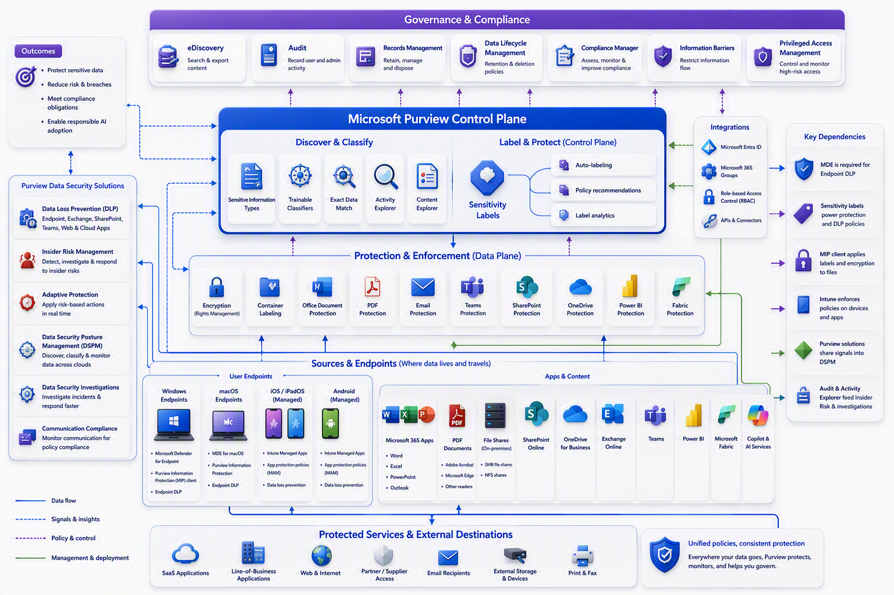

# The Microsoft Purview Ecosystem for Beginners

A beginner-friendly guide to data governance, data security, and compliance

Imagine joining a company on your first day. You receive access to email, Teams, SharePoint, applications, reports, databases, and perhaps Microsoft 365 Copilot. Very quickly, you create documents, share information, download files, build reports, and ask AI assistants for help.

Now imagine the same activity multiplied across thousands of people, hundreds of applications, several clouds, and many years.

That is the world Microsoft Purview is designed for.

Microsoft describes Purview as a portfolio spanning data governance, data security, and data compliance. Its solutions include Data Map, Unified Catalog, Information Protection, Data Loss Prevention, Data Security Posture Management, Insider Risk Management, Audit, eDiscovery, Records Management, Compliance Manager, and related capabilities. The Microsoft Purview portal provides a common entry point for these areas, although the features visible to a user depend on permissions, subscriptions, and configuration.

[Microsoft Purview documentation](https://learn.microsoft.com/en-us/purview/)

[Learn about the Microsoft Purview portal](https://learn.microsoft.com/en-us/purview/purview-portal)

Microsoft Purview can feel overwhelming at first. There are many solutions. Some discover data. Some protect it. Others investigate activity, retain records, or help with regulatory assessments.

The good news is that you do not need to learn everything at once.

The simplest definition is:

Microsoft Purview is a portfolio of solutions that helps organizations understand, govern, protect, and manage data.

It covers three connected areas:

-	Data governance: Understand what data exists, where it is, who owns it, and whether it can be trusted.
-	Data security: Identify sensitive data and protect it from inappropriate access, sharing, or loss.
-	Data compliance: Retain evidence, investigate activity, manage records, and support regulatory obligations.

These areas are available through the unified Microsoft Purview portal. The portal provides a common entry point for solutions, settings, search, permissions, and learning resources.

The architecture illustration is best treated as a map of a city, not as a simple product diagram. Some areas help you inventory the city. Some control traffic. Some protect important buildings. Others provide records of what happened. The following tour connects those areas into one story.

\
\
[Purview Introduction Start Page](/Readme.md)

[Purview Introduction Chapter 1](/PurviewIntroductionChapter1.md)

[Purview Introduction Chapter 2](/PurviewIntroductionChapter2.md)

[Purview Introduction Chapter 3](/PurviewIntroductionChapter3.md)

[Purview Introduction Chapter 4](/PurviewIntroductionChapter4.md)

[Purview Introduction Chapter 5](/PurviewIntroductionChapter5.md)

[Purview Introduction Chapter 6](/PurviewIntroductionChapterä6.md)

[Purview Introduction Chapter 7](/PurviewIntroductionChapter7.md)

[Purview Introduction Chapter 8](/PurviewIntroductionChapter8.md)

[Purview Introduction Chapter 9](/PurviewIntroductionChapter9.md)

[Purview Introduction Chapter 10](/PurviewIntroductionChapter10.md)

[Purview Introduction Chapter 11](/PurviewIntroductionChapter11.md)

[Purview Introduction Chapter 12](/PurviewIntroductionChapter12.md)
